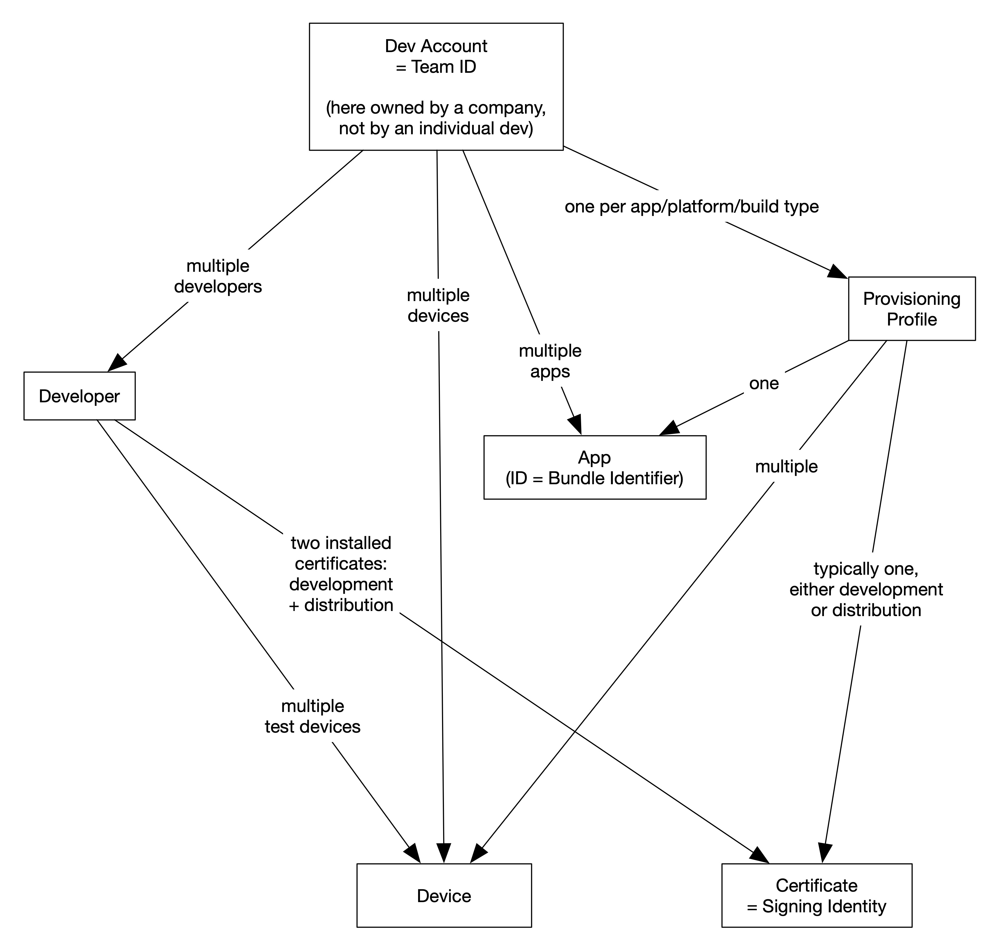

# Code Signing Cheat Sheet

## Basic Motivation

Code Signing protects against any tampering with an app, be it on the developer machine after compilation, during distribution (at Apple), or on the user's device after installation.

## Overview

For illustration, we look at an idealized general scenario in which one team of developers in the context of one company develops multiple apps for multiple platforms (iOS, macOS), and each developer might work on more than one of those apps:

## Essentials

* Developer Account
  * Identified by a team ID, representing the entire development team within the company.
  * All the other concepts, including developers and apps, are associated with this one team ID.
* Certificates (Signing Identities)
  * Only two certificates are needed: Development and Distribution. These are used to sign **all apps** on **all machines**. Install them, along with their private keys, on each developer's machine.
  * Universal "**Apple** Development" and "**Apple** Distribution" certificates cover both macOS and iOS.
  * A developer can generate a certificate on their machine, storing it locally in Keychain Access. The certificate, along with its private key, must be exported and securely shared with the team. A private git repo is generally not considered secure enough for this purpose. All this applies even to the development certificate.
  * Certificates are typically installed in the "Login" keychain, but using "iCloud" could be useful for a developer working across multiple machines.
* Profiles
  * One profile per app, platform, and build type (development / distribution) is required.
    * Example: Codeface macOS Development Profile
  * Each profile connects an app ID with one of the two certificates (development / distribution).
  * Development profiles can also be associated with specific test devices.
  * When creating a distribution profile, the unspecific option "App Store" refers to the iOS App Store.
  * Developers' test devices (or development machines for macOS) must be added to the profile. This doesn't require others to reinstall the profile, as long as they don't use the newly registered device.
  * The same signing identity (certificate) may be referenced by multiple profiles. For example, device tests might use a dedicated profile that contains the corresponding test devices.
* Test Devices
  * To run and debug on an actual device (iPhone, MacBook, etc.), it must be registered and associated with the **development** profile.
  * For macOS, development machines themselves are registered as test devices, as there's no "macOS simulator."
  * With a Mac, be sure to register its **UDID** and not its UUID.

## Tips

* Ensure there are no expired or unused/unintended profiles and certificates installed, as these can confuse Xcode:

    * Keychain Access app
	* System settings -> Privacy & Security -> Profiles -> Provisioning
	
* Cleaning the build, restarting Xcode, or even rebooting the Mac sometimes helps Xcode to recognize newly installed certificates or resolve related issues.

* Register devices by **UDID**, even though the form in App Store Connect is confusing!

    

	macOS system report shows the difference:
	

## Other Aspects

* Role-Based Access Control
  * Assign roles (Admin, Member, etc.) to team members to control permissions related to certificates and profiles management.
* Revocation and Renewal
  * Plan for certificate expiration and renewal. Remember, revoking a certificate affects all associated profiles and signed apps.
* Continuous Integration Systems
  * If using CI systems like Jenkins or GitLab, consider automating certificate and profile handling using tools like Fastlane.
* Two-Factor Authentication
  * Be aware of two-factor authentication when sharing accounts across developers. It might require additional coordination.
* App-Specific Passwords
  * App-specific passwords can give people (or the CI) selective access to the developer account, for example so they can manage and release only one specific app.
* Notarization for macOS Apps
  * If distributing macOS apps outside the App Store, understand the notarization process, which provides an extra layer of security.