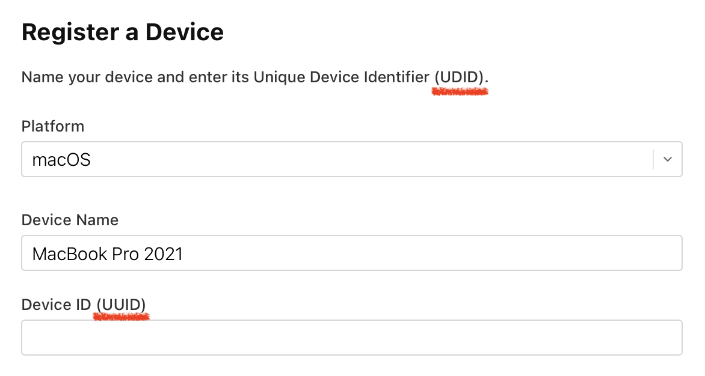

# Code Signing Cheat Sheet

## Basic Motivation

Code Signing protects against any tampering with an app, be it on the developer machine after compilation, during distribution (at Apple), or on the user's device after installation.

## Overview

For illustration, we look at an idealized general scenario in which one team of developers in the context of one company develops multiple apps for multiple platforms (iOS, macOS), and each developer might work on more than one of those apps:

* Developer Account
  * Identified by a team ID
  * All the other concepts, including the developers, are in context of- and associated with that one team ID.

* Certificates (Signing Identities)
  * Only two certificates (Development and Distribution) to sign **all apps** on **all machines**. Install them with their private keys on each machine.
  * Universal "**Apple** Development-" and "**Apple** Distribution" certificates that cover macOS and iOS
  * A dev can generate a certificate private on their machine. It gets stored locally in Keychain Access. The dev should then export the certificate including its private key and securely share it with the team, including the password. Storing that with the codebase in a private git repo is generally not considered to be secure enough.
  * Typically, devs install the certificate in their "Login" keychain, but "iCloud" could make sense for a dev who uses multiple development machines.

* Profiles
  * One profile per app, platform and build type (development / distribution)
    * Example: Codeface macOS Development Profile
  * Each profile connects an app ID with one of the two certificates (development / distribution)
    * Development profiles can also be associated with one or more test devices
  * When creating a distribution profile, the unspecific option "App Store" means the iOS app store
  * When a developer joins the team, their test devices (for macOS their development machine) must typically be added to the profile. Others are not required to re-install the updated profile, as long as they don't use the newly registered device.
  * The same signing identity (certificate) may be referenced by multiple profiles. For example, device tests might use a dedicated profile that contains the corresponing test devices

* Test devices
  * To run and debug an app on an actual device (iPhone, MacBook etc.), the device must be registered and associated with the **development** profile
  * For macOS apps, it is necessary to register the development machines as test devices, since there is no such thing as a "macOS simulator"
  * With a Mac, be careful to register its **UDID** and not its UUID

* Tips
  * Ensure there are no expired or unused/unintended profiles installed (see system settings -> Privacy & Security -> Profiles -> provisioning), because that can confuse Xcode
  * Ensure there are no expired or unused/unintended certificates installed (see the Keychain Access app), because that often confuses Xcode
  * It seems it is sometimes necessary to clean the project in Xcode, restart Xcode or even restart the Mac, so that Xcodes finds certificates or their private keys

## Pitfalls

* Register devices by **UDID**, even though the form in App Store Connect is confusing!

    

	macOS system report shows the difference:
	